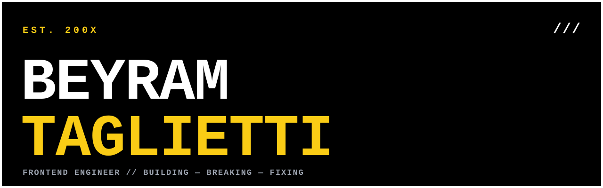

  

  

| #      | PROJECT           | WHAT IT IS                                  |
| ------ | ----------------- | ------------------------------------------- |
| **01** | **NORSE VENTURE** | Trip planning cross-platform app            |
| **02** | **REDO**          | Repetitive tasks manager cross-platform app |
| **03** | **OKTAGON**       | MMA events reminder Telegram miniapp        |
| **04** | **TRACKIT**       | AI calorie tracker Telegram miniapp         |

  

| #      | COMPANY                          | ROLE                       | PERIOD                |
| ------ | -------------------------------- | -------------------------- | --------------------- |
| **01** | **TALENTWARE**                   | Frontend Engineer          | 2026-01 — **PRESENT** |
| **02** | **NEOSPERIENCE S.P.A.**          | Frontend Engineer          | 2023-05 — 2026-01     |
| **03** | **EFFEPI SOFT S.R.L.**           | Software Engineer          | 2021-12 — 2023-05     |
| **04** | **INTERSAIL ENGINEERING S.R.L.** | Web Developer (Internship) | 2021-08 — 2021-12     |

  
  

  

